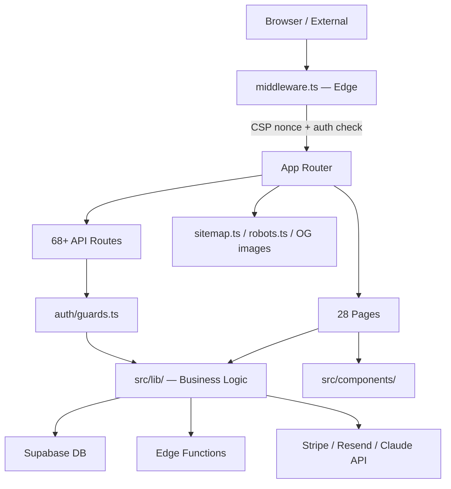

# Pages & Routes — src/app/

> Next.js App Router: 28 pages and 68 API routes. All routes are server components by default; client components marked `"use client"`.

## Page Map

### Public / Marketing
| Route | File | Purpose |
|-------|------|---------|
| `/` | `page.tsx` | Homepage: hero, value props, pricing table, testimonials |
| `/about` | `about/page.tsx` | Mission, team, credentials |
| `/contact` | `contact/page.tsx` | Contact form |
| `/resources` | `resources/page.tsx` | Legal database links + local org directory |
| `/editorial-policy` | `editorial-policy/page.tsx` | UPL disclaimer + editorial standards |
| `/privacy` | `privacy/page.tsx` | Privacy policy |
| `/terms` | `terms/page.tsx` | Terms of service |
| `/blog` | `blog/page.tsx` | MDX post listing with category filter |
| `/blog/[slug]` | `blog/[slug]/page.tsx` | Individual post + related posts |
| `/playbooks` | `playbooks/page.tsx` | Catalog of live playbooks |
| `/playbook/[slug]` | `playbook/[slug]/page.tsx` | Long-form sales page (configurable via `playbook-configs.ts`) |
| `/score` | `score/page.tsx` | Defense Strength Score quiz |
| `/score/results/[token]` | `score/results/[token]/page.tsx` | Score visualization + lead capture |
| `/dui-defense/[state]` | `dui-defense/[state]/page.tsx` | State-specific DUI content pages |

### Auth & Checkout
| Route | File | Purpose |
|-------|------|---------|
| `/checkout/success` | `checkout/success/page.tsx` | Post-purchase confirmation |
| `/checkout/error` | `checkout/error/page.tsx` | Checkout failure recovery |
| `/intake` | `intake/page.tsx` | Case Decoder intake form |
| `/intake/intelligence-brief` | `intake/intelligence-brief/page.tsx` | IB Phase 2 intake |

### Protected (Customer Portal)
| Route | File | Purpose |
|-------|------|---------|
| `/my-case` | `my-case/page.tsx` | Single case access (magic link token) |
| `/my-cases` | `my-cases/page.tsx` | All cases for authenticated user |
| `/report/[token]` | `report/[token]/page.tsx` | Case report delivery page |

### Admin / Operator
| Route | File | Purpose |
|-------|------|---------|
| `/operator` | `operator/page.tsx` | Dashboard: active cases, queue, metrics |
| `/operator/cases/[id]` | `operator/cases/[id]/page.tsx` | Case detail + status controls |
| `/admin/demand` | `admin/demand/page.tsx` | Market demand intelligence |
| `/admin/inbox` | `admin/inbox/page.tsx` | Inbound email management |
| `/admin/partners` | `admin/partners/page.tsx` | Partner application review |
| `/partner` | `partner/page.tsx` | Partner portal: commissions dashboard |

## API Route Groups

### Checkout & Payments (4 routes)
| Method | Route | Purpose |
|--------|-------|---------|
| POST | `/api/checkout` | Create Stripe session; uses `tiers.ts` + dual-mode live flag |
| POST | `/api/checkout/verify` | Verify session + webhook idempotency |

### Webhooks (4 routes)
| Method | Route | Purpose |
|--------|-------|---------|
| POST | `/api/webhooks/stripe` | Order + refund processing; creates `orders` + `cases` rows |
| POST | `/api/webhooks/resend` | Delivery tracking + bounce handling |
| POST | `/api/webhooks/resend-inbound` | Email reply parsing → operator inbox |
| POST | `/api/webhooks/engine/delivery` | Engine job completion notifications |

### Customer Auth (5 routes)
| Method | Route | Purpose |
|--------|-------|---------|
| POST | `/api/customer/magic-link` | Send magic link email |
| POST | `/api/customer/magic-link/verify` | Exchange token for session cookie |
| POST | `/api/customer/logout` | Clear session cookie |
| GET | `/api/customer/cases` | List user's cases |

### Intake & Case Management (7 routes)
| Method | Route | Purpose |
|--------|-------|---------|
| POST | `/api/intake` | Submit intake → create processing jobs |
| POST | `/api/intake/intelligence-brief` | IB-specific intake (Phase 2) |
| POST | `/api/upload` | Begin multipart document upload |
| POST | `/api/upload/finalize` | Complete upload → trigger OCR job |
| POST | `/api/operator/cases` | Admin case CRUD |
| PATCH | `/api/operator/cases/[id]/status` | Update case status (state machine transition) |

### Report Generation & Delivery (5 routes)
| Method | Route | Purpose |
|--------|-------|---------|
| POST | `/api/generate/case-decoder` | Trigger Case Decoder Edge Function |
| POST | `/api/generate/intelligence-brief/*` | Trigger IB phases (5 parallel + 4 sequential) |
| POST | `/api/evaluate/case-decoder` | UPL compliance evaluation |
| POST | `/api/deliver` | Email report to customer + set `delivered_at` |
| GET | `/api/download/[token]` | Download token validation |

### Scoring & Free Tools (5 routes)
| Method | Route | Purpose |
|--------|-------|---------|
| GET | `/api/score` | Fetch score by token |
| POST | `/api/score/route` | Submit quiz responses |
| POST | `/api/score/share` | Social share lead capture |

### Cron Tasks (13 routes — see lib/CONTEXT.md for task list)
All cron routes: `GET /api/cron/*` — authenticated via `CRON_SECRET` header.
Main orchestrator: `/api/cron/drip` — runs all 22 tasks sequentially.

### Admin-Only (8 routes)
| Method | Route | Purpose |
|--------|-------|---------|
| GET/POST | `/api/admin/demand/*` | Market intelligence CRUD |
| POST | `/api/admin/blog-pipeline` | Trigger blog generation |
| POST | `/api/admin/feature-flags` | Toggle feature flags |

### Partner Portal (8 routes)
| Method | Route | Purpose |
|--------|-------|---------|
| POST | `/api/partner/magic-link` | Partner login |
| GET | `/api/partner/dashboard` | Commission stats |
| PATCH | `/api/partner/settings` | Profile update |
| POST | `/api/partners/apply` | Referral application |

### Charge Taxonomy (3 routes)
`GET /api/charge-taxonomy/{categories,charges,questions}` — serves `charge-taxonomy.ts` data.

### Miscellaneous (5 routes)
`POST /api/subscribe`, `POST /api/unsubscribe`, `POST /api/indexnow`, `GET /api/health`.

## Auth Middleware

`src/middleware.ts` — Edge middleware runs on every request:
- Injects CSP nonce
- Checks `customer_session` cookie for protected routes (`/my-case`, `/my-cases`, `/report`)
- Checks `operator_session` cookie for admin routes (`/operator`, `/admin`)
- Redirects unauthenticated users to `/`

## Data Flow

**Middleware auth matrix:**
| Route pattern | Auth mechanism | Checked in |
|---------------|---------------|------------|
| `/api/admin/*` | `x-admin-password` header (HMAC-SHA256) | middleware.ts |
| `/api/generate/*`, `/api/evaluate/*`, `/api/deliver` | Bearer OPERATOR_SECRET | middleware.ts |
| `/api/cron/*` | Bearer CRON_AUTH_TOKEN | middleware.ts |
| `/api/customer/*`, `/my-case/*` | `customer-session` cookie exists (Edge) → full validation in route | middleware.ts + route handler |
| `/api/partner/*`, `/partner/*` | `partner-session` cookie exists (Edge) → full validation in route | middleware.ts + route handler |

## Key Constants

| Constant | Value | File:Line |
|----------|-------|-----------|
| `TIER_CORE` | 14 tiers (pricing + Stripe IDs) | `src/lib/tiers.ts:30-256` |
| `PLAYBOOK_CONFIGS` | 8 charge-type sales pages | `src/lib/playbook-configs.ts` |
| `SITE_URL` | `https://imnotanattorney.com` | `src/lib/site.ts:35-36` |
| `metadataBase` | `new URL(SITE_URL)` | `layout.tsx:71` |
| `title.template` | `"%s \| ImNotAnAttorney"` | `layout.tsx:74` |
| `maxDuration` (cron/demand-fetch) | 300s | `api/cron/demand-fetch/route.ts:19` |
| `maxDuration` (cron/demand-score) | 120s | `api/cron/demand-score/route.ts:21` |
| `maxDuration` (cron/blog-qa) | 120s | `api/cron/blog-qa/route.ts:27` |
| `maxDuration` (cron/blog-publish) | 60s | `api/cron/blog-publish/route.ts:22` |
| `revalidate` (score-summary) | 300s (5 min ISR) | `api/stats/score-summary/route.ts:9` |
| `revalidate` (defense-score-data) | 3600s (1 hr ISR) | `research/defense-score-data/page.tsx:6` |

## How To

- **Add a new page:** Create `src/app/[route]/page.tsx`. If it's a sales page, add a config to `src/lib/playbook-configs.ts` and use `PlaybookSalesPage`. Update sitemap: `src/app/sitemap.ts`.
- **Add an API route:** Create `src/app/api/[path]/route.ts`. Export named `GET`/`POST`/`PATCH` handlers. For operator-only routes, call `requireAdmin()` from `src/lib/auth/guards.ts` at the top.
- **Add a cron task:** Add task function to `src/lib/cron/`, register it in the main cron orchestrator. See `src/lib/CONTEXT.md` for the task list and pattern.
- **Add a new tier:** Update `src/lib/tiers.ts` (TIER_CORE) first. Then add a `PlaybookConfig` to `playbook-configs.ts`. Run `node scripts/check-tiers.mjs` to verify sync.

## Integration Points

**Imports from lib (highest traffic):**
- `@/lib/tiers` — TIER_CORE, upgradePrice (homepage, checkout, services, about)
- `@/lib/site` — SITE_URL, signOperatorToken, normalizeEmail (all email routes, schema generation)
- `@/lib/supabase/admin` — createAdminClient() (all API routes touching DB)
- `@/lib/email` — sendEmail(), escapeHtml (webhooks, cron, delivery)
- `@/lib/stripe` — stripeForTier() (checkout, webhooks)
- `@/lib/auth/guards` — requireAdmin(), requireCron(), requireCustomerAuth() (all protected routes)
- `@/lib/schema` — JSON-LD generators (pages with structured data)
- `@/lib/blog` — getAllPosts(), getPostBySlug() (blog pages, sitemap)
- `@/lib/playbook-configs` — allPlaybookSlugs(), PLAYBOOK_CONFIGS (playbook pages, sitemap)

**Imports from components (highest traffic):**
- Header, Footer (root layout)
- HomepageHero, ChargeTypeSelector, PricingTable, TrustBadges, TestimonialSection (homepage)
- LeadCapture, BlogCTA, BlogCard (blog pages)
- AdminNav, StatusBadge (operator/admin pages)
- motion/* (FadeInUp, StaggerContainer — used across pages)

**Shared state:**
- `customer-session` cookie — set by customer auth, read by middleware + route handlers
- `partner-session` cookie — set by partner auth, read by middleware + route handlers
- CSP nonce — generated in middleware, read in layout.tsx via `headers()`

**Edge Functions called from API routes:**
- `generate-report` ← `/api/generate/case-decoder` (fire-and-forget POST)
- `evaluate-report` ← `/api/evaluate/case-decoder` (fire-and-forget POST)

## Gotchas

1. **CSP nonce forces dynamic rendering.** Root layout calls `await headers()` for the nonce, disabling static optimization for all pages. ISR `revalidate` values still work for data freshness but pages re-render per request.

2. **Dual-mode Stripe keys.** If a tier has `live: true` but `STRIPE_SECRET_KEY_LIVE` is missing, checkout crashes at runtime. Webhook handler must verify against BOTH test and live webhook secrets.

3. **Middleware auth is Edge-only (no DB calls).** Customer/partner cookie existence is checked in Edge, but full session validation happens in Node route handlers. A valid cookie with an expired DB session returns 401 from the route, not middleware.

4. **Cron routes are fire-and-forget from cron-job.org.** `maxDuration` limits vary (10s–300s). If a job exceeds its limit, Vercel kills it mid-execution. The cron idempotency lock may stay in `running` state for up to 5 minutes before stale recovery.

5. **Blog/playbook slugs are not redirected on rename.** If you rename a blog slug or playbook config, old URLs return 404. Add redirects in `next.config.ts` for renamed content.

6. **Sitemap must be updated manually.** New pages/blog posts are not auto-discovered. Update `sitemap.ts` when adding pages.

7. **OG images use Edge runtime.** Cannot import external images or fonts. Use inline data URLs or hardcoded font files.

## Maintenance Triggers

- **New page added** → Add to Page Map + sitemap.ts
- **New API route added** → Add to API Route Groups table
- **Auth guard changed** → Update middleware auth matrix above
- **New maxDuration or revalidate** → Update Key Constants table
- **New lib module imported across 3+ routes** → Add to Integration Points
- **Middleware logic changed** → Update Data Flow diagram + auth matrix
